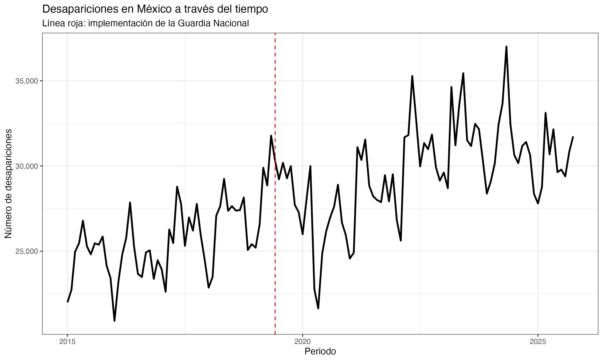
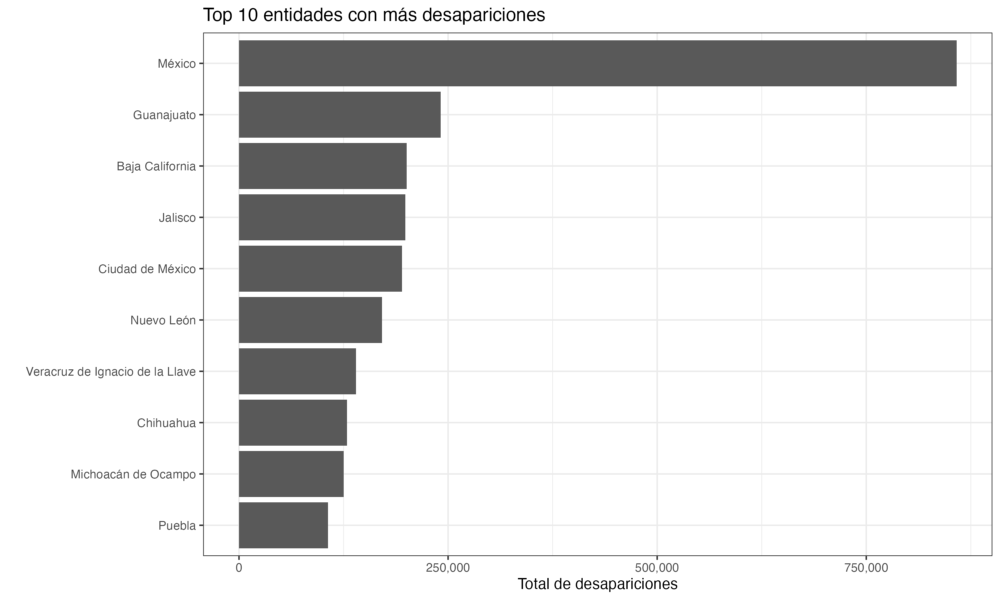
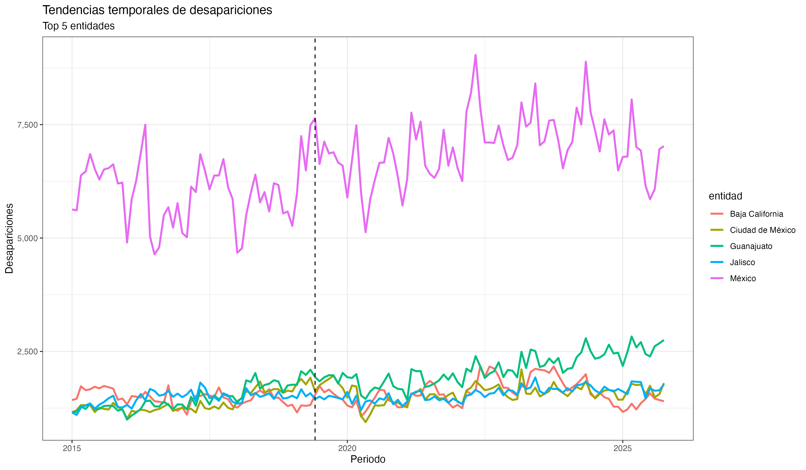
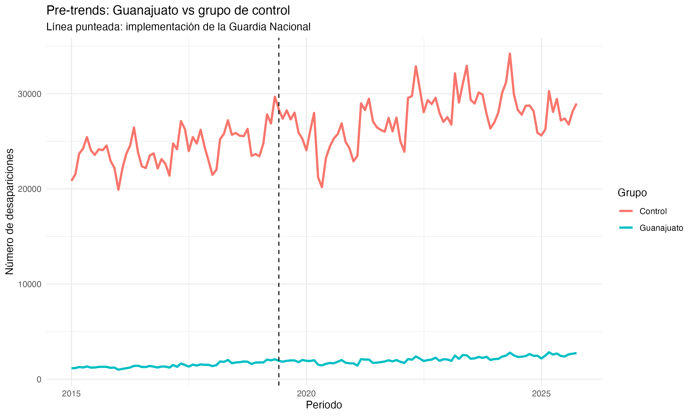
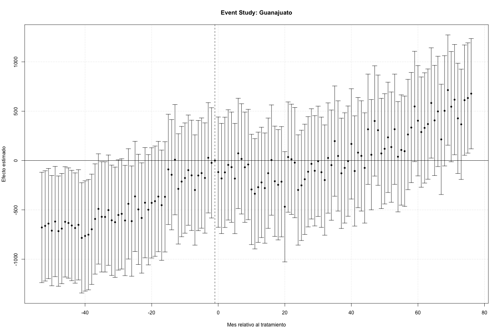
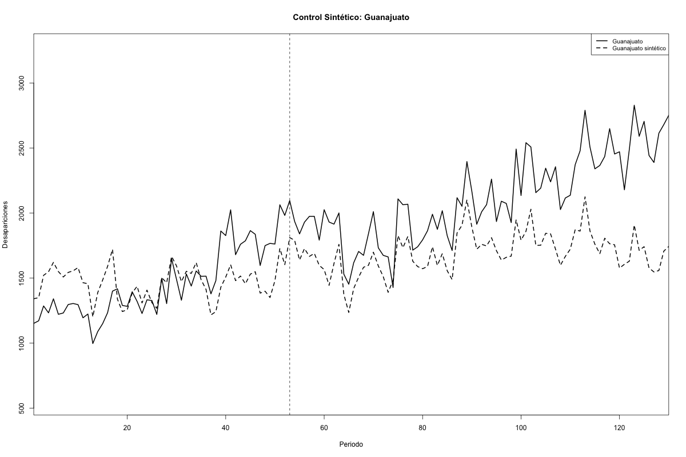
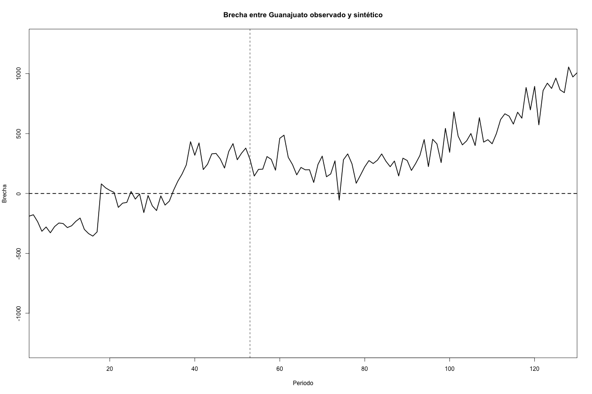

\newpage

# Introducción

Las desapariciones de personas en México constituyen uno de los problemas públicos más graves del país. Además de su dimensión humanitaria, jurídica y social, el fenómeno presenta una estructura temporal y territorial compleja: las desapariciones no ocurren de manera homogénea entre entidades federativas ni evolucionan de forma constante a través del tiempo. Por ello, su análisis requiere herramientas estadísticas capaces de incorporar tanto la dimensión temporal como la comparación entre regiones.

En este proyecto se propone evaluar el posible efecto causal asociado con la aparición e implementación de la Guardia Nacional sobre el comportamiento de las desapariciones en México. La Guardia Nacional fue planteada como una intervención de seguridad pública de alcance nacional; sin embargo, su presencia, intensidad operativa y efectos potenciales pueden variar entre entidades federativas. Esta variación permite estudiar si ciertos estados experimentaron cambios diferenciales en las desapariciones después de la intervención, en comparación con estados que funcionen como grupo de control.

El objetivo del estudio no es únicamente describir la evolución de las desapariciones, sino construir un marco causal que permita aproximar el contrafactual: qué habría ocurrido con las desapariciones en ciertas entidades si la intervención asociada con la Guardia Nacional no hubiera ocurrido o no hubiera tenido la misma intensidad. Para ello, se utilizarán dos metodologías principales de inferencia causal en contextos dinámicos: Diferencia en Diferencias y Controles Sintéticos.

La estrategia de Diferencia en Diferencias permitirá estimar el efecto promedio del tratamiento sobre las unidades tratadas, comparando los cambios antes y después de la intervención entre entidades tratadas y entidades de control. Por su parte, el método de Control Sintético permitirá construir, para una entidad tratada específica, una combinación ponderada de entidades no tratadas que reproduzca su comportamiento previo a la intervención y funcione como contrafactual posterior.

Este enfoque se alinea con los objetivos del proyecto final del curso, ya que combina una revisión conceptual de métodos de inferencia causal con una aplicación empírica a datos reales, incluyendo interpretación, visualización y discusión de supuestos. Además, el proyecto se desarrollará de forma reproducible en R, fijando semillas cuando se utilicen procedimientos aleatorios y separando el reporte principal de los archivos de experimentación y limpieza de datos.

## Pregunta de investigación

La pregunta principal del proyecto es:

\begin{quote}
¿Cuál fue el efecto causal asociado con la aparición e implementación de la Guardia Nacional sobre las desapariciones en México?
\end{quote}

De forma más específica, se busca responder:

\begin{quote}
¿Las entidades con mayor exposición o intensidad de presencia de la Guardia Nacional presentaron un cambio diferencial en las desapariciones después de la intervención, en comparación con entidades similares con menor exposición?
\end{quote}

## Hipótesis de trabajo

La hipótesis general es que la implementación de la Guardia Nacional pudo modificar la dinámica de desapariciones en ciertas entidades federativas. Sin embargo, el signo esperado del efecto no es necesariamente evidente. Por un lado, una mayor presencia de seguridad pública podría estar asociada con una reducción en desapariciones si efectivamente inhibe la actividad criminal. Por otro lado, también podría observarse un aumento si la intervención se concentra en regiones con deterioro previo de seguridad, si genera desplazamiento de violencia, o si mejora los mecanismos de denuncia y registro.

Por esta razón, el análisis se plantea de forma empírica y causal, evitando asumir de antemano que el efecto debe ser positivo o negativo. El interés principal será estimar y discutir el cambio diferencial observado, bajo los supuestos de identificación de los métodos utilizados.

# Datos

Para el análisis se consideran datos observados sobre desapariciones en México. La información utilizada proviene del Registro Nacional de Personas Desaparecidas y No Localizadas (RNPDNO), base de datos oficial administrada por la Comisión Nacional de Búsqueda (CNB), la cual concentra y actualiza información sobre personas desaparecidas y no localizadas en el país.

Los datos empleados en este proyecto fueron obtenidos a partir de la Consulta Pública del RNPDNO. En particular, la recopilación, estructuración y organización inicial de los datos se realizó utilizando el repositorio público desarrollado por Montserrat, disponible en:

\begin{center}
\texttt{https://github.com/lapanquecita/personas-desaparecidas}
\end{center}

Dicho repositorio contiene scripts para descargar, limpiar y analizar la información pública del RNPDNO, permitiendo construir bases de datos estructuradas para análisis estadístico y temporal.

La información disponible incluye variables relacionadas con fecha de desaparición, entidad federativa, municipio, sexo, edad, estatus y otras características relevantes asociadas a los registros de desaparición.

Para el presente estudio se utilizarán principalmente dos conjuntos de datos:

\begin{enumerate}
\item \texttt{data.csv}, que contiene registros individuales o más desagregados de desapariciones.
\item \texttt{timeseries\_victimas.csv}, que contiene información agregada en formato de serie temporal, incluyendo variables como periodo, entidad federativa y número total de víctimas.
\end{enumerate}

Dado el objetivo causal del proyecto, el archivo \texttt{timeseries\_victimas.csv} será la principal fuente para la construcción del panel temporal entidad--periodo. El archivo \texttt{data.csv} podrá utilizarse como fuente complementaria para exploración descriptiva, validación de patrones generales y construcción de visualizaciones auxiliares.

## Unidad de análisis

La unidad de análisis será:

\[
(i,t) = (\text{entidad federativa}, \text{periodo})
\]

donde \(i\) representa la entidad federativa y \(t\) representa el periodo temporal de observación. En principio, se trabajará con frecuencia mensual, siempre que la estructura final de la base lo permita.

La variable de resultado será el número de desapariciones registradas en la entidad \(i\) durante el periodo \(t\), denotada por:

\[
Y_{it}.
\]

Dependiendo de la disponibilidad de información poblacional, se considerará utilizar tasas de desaparición por cada 100,000 habitantes con el objetivo de mejorar la comparabilidad entre entidades federativas con tamaños poblacionales distintos.

## Variable de tratamiento

La variable de tratamiento buscará capturar la exposición de cada entidad federativa a la Guardia Nacional. Esta definición representa una de las principales decisiones metodológicas del proyecto, ya que la Guardia Nacional tuvo alcance nacional, pero con intensidad de despliegue potencialmente distinta entre entidades.

De manera preliminar, se consideran las siguientes posibilidades para operacionalizar el tratamiento:

\begin{enumerate}
\item Clasificar como tratadas aquellas entidades con alta presencia o despliegue de Guardia Nacional.
\item Construir una medida relativa de intensidad utilizando información sobre efectivos, cuarteles u operativos.
\item Identificar entidades prioritarias de intervención y compararlas con entidades de menor exposición.
\end{enumerate}

En una primera aproximación se utilizará una definición binaria de tratamiento:

\[
G_i =
\begin{cases}
1, & \text{si la entidad } i \text{ pertenece al grupo tratado}, \\
0, & \text{si la entidad } i \text{ pertenece al grupo de control}.
\end{cases}
\]

Asimismo, se definirá un periodo posterior a la intervención:

\[
Post_t =
\begin{cases}
1, & \text{si } t \text{ ocurre después de la implementación de la Guardia Nacional}, \\
0, & \text{si } t \text{ ocurre antes de la implementación de la Guardia Nacional}.
\end{cases}
\]

La variable de tratamiento efectiva será:

\[
D_{it} = G_i \times Post_t.
\]

## Construcción esperada del panel

El análisis se realizará sobre una estructura tipo panel con observaciones por entidad y periodo temporal. La construcción general del panel tendrá la siguiente forma conceptual:

\[
(\text{Entidad}, \text{Periodo}, \text{Desapariciones}, \text{Tratamiento})
\]

La ventana temporal definitiva será seleccionada buscando contar con suficientes periodos pretratamiento y postratamiento, lo cual es particularmente importante para evaluar la plausibilidad del supuesto de tendencias paralelas en Diferencia en Diferencias y para construir adecuadamente el contrafactual en Control Sintético.

## Preprocesamiento y limpieza de datos

Como primera etapa del proyecto, se realizó un proceso de limpieza y estandarización de las bases de datos obtenidas del RNPDNO. Este procedimiento tuvo como objetivo generar conjuntos de datos consistentes y reproducibles para el análisis causal posterior.

Las principales actividades realizadas fueron las siguientes:

\begin{enumerate}
\item Carga de los archivos originales utilizando \texttt{readr}.
\item Estandarización de nombres de variables mediante la librería \texttt{janitor}.
\item Conversión y validación de variables temporales.
\item Revisión de valores faltantes y consistencia estructural de las bases.
\item Verificación de cobertura temporal y territorial de los registros.
\item Generación de versiones limpias y reproducibles de las bases de datos.
\end{enumerate}

Después del proceso de limpieza, se obtuvieron dos conjuntos de datos principales:

\begin{itemize}
\item \texttt{data\_clean.csv}, que contiene registros individuales de desapariciones.
\item \texttt{timeseries\_clean.csv}, que contiene información agregada en formato temporal y que será utilizada para la construcción del panel entidad--periodo.
\end{itemize}

La base agregada contiene información para las 32 entidades federativas de México y cubre observaciones desde 2015, lo cual permite contar con periodos pretratamiento y postratamiento adecuados para los métodos de inferencia causal considerados en el estudio.

## Construcción del panel entidad--periodo

Una vez finalizado el proceso de limpieza y validación de las bases de datos, se procedió a construir el conjunto de datos principal para el análisis causal. Dado que el objetivo del proyecto consiste en estudiar cambios en desapariciones a través del tiempo y entre entidades federativas, se construyó una estructura tipo panel con observaciones por entidad y periodo temporal.

La unidad de análisis del estudio quedó definida como:

\[
(i,t) = (\text{entidad federativa}, \text{periodo})
\]

donde \(i\) representa la entidad federativa y \(t\) representa el periodo mensual de observación.

A partir de la base \texttt{timeseries\_clean.csv}, se agregaron las observaciones por entidad y mes, obteniendo una medida mensual del número total de desapariciones registradas en cada estado. Formalmente, la variable de resultado utilizada en esta etapa se define como:

\[
Y_{it} = \text{Número de desapariciones en la entidad } i \text{ durante el periodo } t.
\]

Posteriormente, se construyó una variable temporal asociada con el periodo posterior a la implementación de la Guardia Nacional:

\[
Post_t =
\begin{cases}
1, & \text{si } t \geq \text{junio de 2019}, \\
0, & \text{en otro caso}.
\end{cases}
\]

La fecha de junio de 2019 fue seleccionada debido a que corresponde al inicio formal de operaciones de la Guardia Nacional en México. Esta variable permitirá posteriormente identificar cambios diferenciales en las trayectorias temporales de desapariciones antes y después de la intervención.

El resultado final de esta etapa fue la construcción de un panel balanceado para las 32 entidades federativas del país. Cada entidad cuenta con 130 observaciones mensuales, lo cual implica que todas las unidades presentan la misma cobertura temporal dentro de la ventana de estudio.

La estructura balanceada del panel representa una ventaja importante para los métodos de inferencia causal considerados en este proyecto, particularmente para modelos de Diferencia en Diferencias y estudios de eventos, ya que facilita la comparación entre grupos tratados y de control a lo largo del tiempo y reduce problemas derivados de observaciones faltantes o periodos desalineados.

Asimismo, contar con una estructura temporal homogénea permitirá posteriormente analizar tendencias previas a la intervención, evaluar la plausibilidad del supuesto de tendencias paralelas y construir contrafactuales más consistentes mediante técnicas de control sintético.

## Análisis exploratorio de datos

Como primera aproximación empírica, se realizó un análisis exploratorio de la serie temporal de desapariciones con el objetivo de identificar patrones generales, heterogeneidad entre entidades federativas y posibles cambios alrededor del periodo de implementación de la Guardia Nacional.

Este análisis todavía no tiene una interpretación causal directa, pero resulta fundamental para motivar el diseño empírico posterior. En particular, permite observar si existen tendencias temporales relevantes, qué entidades concentran una mayor proporción de registros y si algunas trayectorias estatales podrían ser candidatas para construir grupos de tratamiento y control.

### Evolución nacional de desapariciones

La Figura \ref{fig:serie-nacional} presenta la evolución mensual del número total de desapariciones registradas en México. La línea vertical punteada indica junio de 2019, periodo utilizado como referencia preliminar para la implementación de la Guardia Nacional.

```{r serie-nacional, echo=FALSE, fig.align='center', out.width='82%', fig.pos='H', fig.cap='Desapariciones en México a través del tiempo.'}

```

La serie nacional muestra una tendencia creciente a lo largo del periodo de estudio, acompañada de una volatilidad mensual considerable. Posterior a 2019 se observan niveles generalmente más altos que en los primeros años de la muestra. Sin embargo, esta comparación agregada debe interpretarse con cautela, ya que puede estar influida por cambios generales en el país, variaciones en los mecanismos de denuncia, diferencias estatales y eventos concurrentes no atribuibles directamente a la Guardia Nacional.

Por esta razón, el análisis causal no se basará únicamente en la serie nacional agregada, sino en una estructura tipo panel que permita comparar entidades federativas con distintas trayectorias y niveles de exposición a la intervención.

### Entidades con mayor número acumulado de desapariciones

La Figura \ref{fig:top10-estados} muestra las diez entidades con mayor número acumulado de desapariciones durante el periodo analizado.

```{r top10-estados, echo=FALSE, fig.align='center', out.width='82%', fig.pos='H', fig.cap='Diez entidades con mayor número acumulado de desapariciones.'}

```

El análisis acumulado muestra una fuerte heterogeneidad territorial. En particular, el Estado de México concentra el mayor número de desapariciones registradas en el periodo, con una diferencia considerable respecto al resto de las entidades. Le siguen Guanajuato, Baja California, Jalisco, Ciudad de México y Nuevo León, entre otras.

Esta heterogeneidad es relevante para el diseño causal porque sugiere que las entidades no son directamente comparables en niveles. Por ello, los métodos utilizados deberán apoyarse en comparaciones temporales, tendencias pretratamiento y construcción de contrafactuales, más que en comparaciones simples de niveles promedio.

### Tendencias temporales en las principales entidades

La Figura \ref{fig:tendencias-top5} presenta las trayectorias mensuales de desapariciones para las cinco entidades con mayor número acumulado de registros.

```{r tendencias-top5, echo=FALSE, fig.align='center', out.width='82%', fig.pos='H', fig.cap='Tendencias temporales de desapariciones en las cinco entidades con mayor número acumulado.'}

```

Las trayectorias estatales evidencian diferencias importantes tanto en niveles como en evolución temporal. El Estado de México presenta niveles considerablemente superiores al resto de las entidades, lo cual sugiere que puede comportarse como una unidad atípica dentro del análisis. Por otro lado, entidades como Guanajuato, Jalisco, Baja California y Ciudad de México presentan trayectorias más cercanas entre sí en ciertos periodos, aunque con diferencias relevantes en la etapa posterior a 2019.

Este resultado es importante para las siguientes etapas del proyecto. En primer lugar, sugiere que la selección del grupo tratado y del grupo de control debe realizarse con cuidado, evitando comparaciones entre entidades con dinámicas excesivamente distintas. En segundo lugar, la visualización de tendencias previas será fundamental para evaluar la plausibilidad del supuesto de tendencias paralelas requerido por el método de Diferencia en Diferencias. Finalmente, la presencia de entidades con trayectorias diferenciadas justifica el uso complementario de Control Sintético, especialmente para analizar casos específicos donde sea posible construir un contrafactual adecuado.

En conjunto, el análisis exploratorio muestra que el fenómeno de desapariciones en México presenta una dimensión temporal y territorial suficientemente rica para ser estudiada mediante métodos dinámicos de inferencia causal. La siguiente etapa consistirá en definir formalmente las entidades tratadas y de control, así como estimar los modelos causales propuestos.

# Diferencia en Diferencias (DID)

## Modelo básico de Diferencia en Diferencias

Como primera aproximación causal, se estimó un modelo básico de Diferencia en Diferencias (Difference-in-Differences, DID), utilizando a Guanajuato como grupo tratado y al resto de las entidades federativas como grupo de control.

La especificación estimada fue:

$$
Y_{it} = \alpha + \beta_1 Treated_i + \beta_2 Post_t + \beta_3 (Treated_i \times Post_t) + \varepsilon_{it}
$$

donde:

- $Y_{it}$ representa el número de desapariciones en la entidad $i$ y periodo $t$,
- $Treated_i$ indica si la entidad pertenece al grupo tratado,
- $Post_t$ identifica el periodo posterior a junio de 2019,
- y el término de interacción captura el efecto diferencial posterior al tratamiento.

El parámetro de interés es:

$$
\beta_3
$$

el cual representa el efecto promedio del tratamiento sobre el grupo tratado bajo el supuesto de tendencias paralelas.

La Figura \ref{fig:pretrends} presenta la evolución temporal del grupo tratado y el grupo de control.

```{r pretrends, echo=FALSE, out.width="90%", fig.cap="Comparación de tendencias temporales entre Guanajuato y el grupo de control.", fig.pos='H'}

```

Visualmente, ambas series presentan una tendencia creciente antes de la implementación de la Guardia Nacional, aunque existen diferencias importantes en niveles. Esto sugiere que el supuesto de tendencias paralelas debe interpretarse con cautela y posteriormente validarse mediante especificaciones más robustas.

## Resultados del modelo DID básico

El modelo básico DID produjo un coeficiente positivo y estadísticamente significativo para el término de interacción:

$$
\widehat{\beta}_3 \approx 543
$$

lo que sugiere que, posterior a 2019, Guanajuato presentó aproximadamente 543 desapariciones adicionales por periodo respecto a la evolución observada en el grupo de control.

Sin embargo, esta especificación todavía no controla por heterogeneidad no observada entre entidades ni por shocks agregados comunes en el tiempo, por lo que sus resultados deben interpretarse únicamente como evidencia preliminar.

## Resultados del modelo DID con efectos fijos

Para controlar por heterogeneidad inobservable constante en el tiempo y por shocks comunes a todas las entidades, se estimó un modelo DID con efectos fijos de entidad y periodo:

$$
Y_{it} = \alpha_i + \delta_t + \beta (Treated_i \times Post_t) + \varepsilon_{it}
$$

donde:

- $\alpha_i$ representa efectos fijos por entidad,
- $\delta_t$ representa efectos fijos temporales,
- y el coeficiente de interacción mide el efecto diferencial posterior al tratamiento.

El resultado principal fue:

$$
\widehat{\beta} \approx 542.6
$$

con alta significancia estadística ($p < 0.001$).

Este resultado sugiere que, incluso después de controlar por diferencias estructurales entre entidades y variaciones comunes en el tiempo, Guanajuato experimentó un incremento diferencial en desapariciones posterior a la implementación de la Guardia Nacional.

No obstante, es importante enfatizar que este resultado no implica necesariamente causalidad definitiva, ya que la validez del DID depende críticamente del supuesto de tendencias paralelas y de la ausencia de shocks simultáneos específicos para Guanajuato. Por esta razón, en las siguientes etapas se explorarán metodologías complementarias, particularmente Event Study y Control Sintético, para evaluar la robustez de los resultados obtenidos.

## Estudio de eventos

Para complementar el modelo de Diferencia en Diferencias, se estimó un estudio de eventos. Esta especificación permite analizar la evolución dinámica del efecto relativo antes y después de la fecha de intervención. En particular, el estudio de eventos es útil para evaluar si existían diferencias sistemáticas entre el grupo tratado y el grupo de control antes de la implementación de la Guardia Nacional.

La especificación general estimada fue:

$$
Y_{it}
=
\alpha_i
+
\lambda_t
+
\sum_{k \neq -1}
\delta_k
\mathbf{1}(t - T_0 = k) \cdot Treated_i
+
\varepsilon_{it},
$$

donde \(k\) representa el tiempo relativo respecto a junio de 2019, \(T_0\) es el periodo de referencia de la intervención, \(\alpha_i\) son efectos fijos por entidad y \(\lambda_t\) son efectos fijos por periodo. El periodo \(k=-1\) se omite como categoría de referencia.

```{r event-study, echo=FALSE, fig.align='center', out.width='82%', fig.pos='H', fig.cap='Estudio de eventos para Guanajuato respecto al grupo de control.'}

```

La Figura \ref{fig:event-study} muestra la evolución de los coeficientes estimados en tiempo relativo al tratamiento. Los puntos representan los efectos estimados para cada periodo y las líneas verticales corresponden a los intervalos de confianza.

Los resultados muestran que el efecto estimado no aparece como un salto inmediato justo después de junio de 2019. En los periodos cercanos a la intervención, varios coeficientes se mantienen cerca de cero y no presentan evidencia estadística clara de un cambio abrupto. Sin embargo, en los periodos posteriores más alejados se observa una tendencia creciente en los coeficientes estimados, lo cual sugiere que la diferencia entre Guanajuato y el grupo de control se amplía gradualmente después de la intervención.

No obstante, también se observan coeficientes negativos y estadísticamente significativos en algunos periodos previos al tratamiento, especialmente en meses lejanos al periodo de referencia. Esto indica que Guanajuato no necesariamente seguía una trayectoria completamente paralela a la del grupo de control durante todo el periodo pretratamiento. Por esta razón, los resultados del modelo DID deben interpretarse con cautela.

En conjunto, el estudio de eventos sugiere que la evidencia es consistente con una divergencia posterior entre Guanajuato y el grupo de control, pero también muestra limitaciones importantes en la validez del supuesto de tendencias paralelas. Por ello, el análisis se complementará con el método de Control Sintético, que permite construir un contrafactual específico para Guanajuato a partir de una combinación ponderada de entidades donadoras.

## Control Sintético

Como complemento al análisis de Diferencia en Diferencias y al estudio de eventos, se estimó un modelo de Control Sintético para Guanajuato. Este método permite construir una unidad contrafactual a partir de una combinación ponderada de entidades federativas no tratadas. La idea central es generar un ``Guanajuato sintético'' cuya trayectoria previa a junio de 2019 sea lo más parecida posible a la trayectoria observada de Guanajuato.

Formalmente, el control sintético se construye como:

$$
Y^{SC}_{t}
=
\sum_{j=1}^{J}
w_j Y_{jt},
$$

donde \(Y^{SC}_{t}\) representa el resultado del control sintético en el periodo \(t\), \(Y_{jt}\) es el resultado observado en la entidad donadora \(j\), y \(w_j\) son pesos no negativos que satisfacen:

$$
w_j \geq 0,
\qquad
\sum_{j=1}^{J} w_j = 1.
$$

Los pesos se eligen de manera que la combinación ponderada de entidades donadoras reproduzca lo mejor posible la trayectoria pretratamiento de Guanajuato. Después de junio de 2019, la diferencia entre Guanajuato observado y Guanajuato sintético se interpreta como una aproximación del efecto diferencial posterior a la intervención.

```{r synth-control, echo=FALSE, fig.align='center', out.width='82%', fig.pos='H', fig.cap='Trayectoria observada de Guanajuato y trayectoria contrafactual estimada mediante Control Sintético.'}

```

La Figura \ref{fig:synth-control} muestra la comparación entre la trayectoria observada de Guanajuato y su contraparte sintética. Antes de junio de 2019, ambas series presentan una evolución relativamente cercana, aunque el ajuste no es perfecto. Esto indica que el procedimiento logra aproximar de manera razonable la dinámica previa de Guanajuato utilizando una combinación ponderada de otras entidades federativas.

Después del periodo de intervención, se observa una separación creciente entre ambas trayectorias. La serie observada de Guanajuato se mantiene de forma persistente por encima de la trayectoria sintética, lo que sugiere que las desapariciones observadas en Guanajuato fueron mayores que las que se habrían esperado bajo el contrafactual construido por el modelo.

```{r synth-gap, echo=FALSE, fig.align='center', out.width='82%', fig.pos='H', fig.cap='Brecha entre Guanajuato observado y Guanajuato sintético.'}

```

La Figura \ref{fig:synth-gap} presenta la brecha entre Guanajuato observado y Guanajuato sintético, definida como:

$$
\widehat{\tau}_t
=
Y^{obs}_{Guanajuato,t}
-
Y^{SC}_{Guanajuato,t}.
$$

Una brecha cercana a cero indica que el control sintético reproduce adecuadamente la trayectoria observada. Una brecha positiva indica que Guanajuato registró más desapariciones que su contrafactual sintético, mientras que una brecha negativa indicaría lo contrario.

Durante el periodo previo a la intervención, la brecha fluctúa alrededor de niveles relativamente moderados, lo cual sugiere un ajuste pretratamiento razonable. En cambio, después de junio de 2019, la brecha se vuelve persistentemente positiva y aumenta gradualmente. Este patrón es consistente con una divergencia posterior entre Guanajuato y su contrafactual sintético.

Los pesos estimados para construir el control sintético muestran que el algoritmo no dependió de una sola entidad federativa, sino de una combinación de varias entidades donadoras. En particular, Michoacán de Ocampo recibió el mayor peso individual dentro de la combinación sintética, mientras que el resto del peso se distribuyó entre múltiples entidades con aportaciones menores. Esto sugiere que Guanajuato presenta una dinámica difícil de replicar con una sola entidad de comparación, por lo que el modelo utiliza una combinación amplia de trayectorias estatales para aproximar su comportamiento previo.

En conjunto, los resultados del Control Sintético refuerzan la evidencia observada en el análisis de Diferencia en Diferencias y en el estudio de eventos: después de junio de 2019, Guanajuato presenta una trayectoria de desapariciones superior a la estimada por su contrafactual. No obstante, la interpretación causal debe mantenerse con cautela, ya que el diseño depende de que el control sintético capture adecuadamente la evolución que habría seguido Guanajuato en ausencia de la intervención y de que no existan shocks simultáneos específicos para la entidad.
